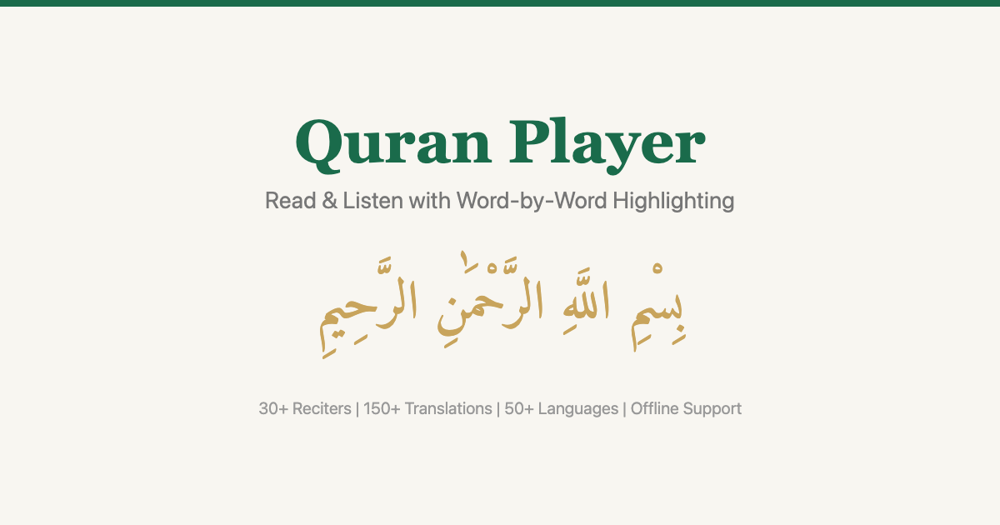
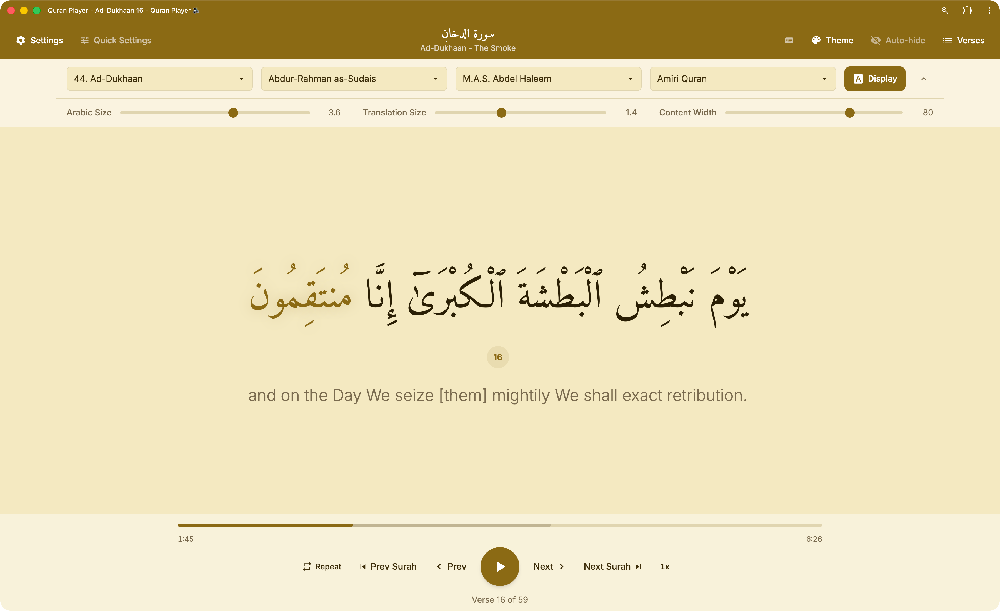

# Quran Player



A clean, focused Quran reader and audio player with synchronized word-by-word highlighting. Built with Vue 3, Vite, and Tailwind CSS v4.

**Live:** [quran.ibnuhx.com](https://quran.ibnuhx.com)



## Features

- **Word-by-word highlighting** - follows along with the recitation using word-level timing data at ~60fps precision
- **30+ reciters** - full surah audio via QuranCDN with per-verse fallback via AlQuran Cloud
- **55+ translations in 28 languages** - English, Arabic, French, German, Turkish, Urdu, Indonesian, and more
- **10 themes** - Light, Dark, Black (OLED), Sepia, Midnight, Nature, Ocean, Rose, Sunset, Lavender
- **Offline support** - installable PWA with service worker caching for fonts, API responses, and assets
- **Playback controls** - adjustable speed (0.5x-2x), repeat (verse/surah), prev/next verse and surah navigation
- **Lock screen controls** - Media Session API integration for play/pause/skip from notification controls
- **Auto-hide controls** - YouTube-style controls that fade out during playback, tap to toggle
- **Swipe gestures** - swipe left/right to navigate verses on mobile
- **Keyboard shortcuts** - Space (play/pause), arrow keys (navigate), ? (help)
- **Customizable display** - Arabic font selection (Amiri Quran, Uthmanic Hafs, Amiri), adjustable font sizes, content width control
- **Responsive** - works on desktop, tablet, and mobile with landscape compact mode
- **SEO ready** - Open Graph, Twitter Cards, JSON-LD structured data

## Tech Stack

- **Vue 3** - Composition API with `<script setup>`
- **Vite** - build tool with PWA plugin
- **Tailwind CSS v4** - styling
- **Pinia** - state management
- **Vue Router** - SPA routing

## Getting Started

```bash
# Install dependencies
npm install

# Start dev server
npm run dev

# Build for production
npm run build

# Preview production build
npm run preview
```

## Deployment

Built for Cloudflare Pages. Includes `_redirects` for SPA routing and `_headers` for security/caching.

**Build settings:**
- Build command: `npm run build`
- Output directory: `dist`

## APIs

- [AlQuran Cloud](https://alquran.cloud) - Quran text, translations, per-verse audio
- [Quran.com / QDC](https://quran.com) - full surah audio, word-level timing segments
- [Quran Foundation](https://verses.quran.foundation) - Uthmanic Hafs font
- [Google Fonts](https://fonts.google.com) - Amiri and Amiri Quran typefaces

## Author

**Muhammad Ibnuh** - [ibnuhx.com](https://ibnuhx.com) - [@ibnuhx](https://x.com/ibnuhx) - [quran@ibnuhx.com](mailto:quran@ibnuhx.com)

## License

MIT
